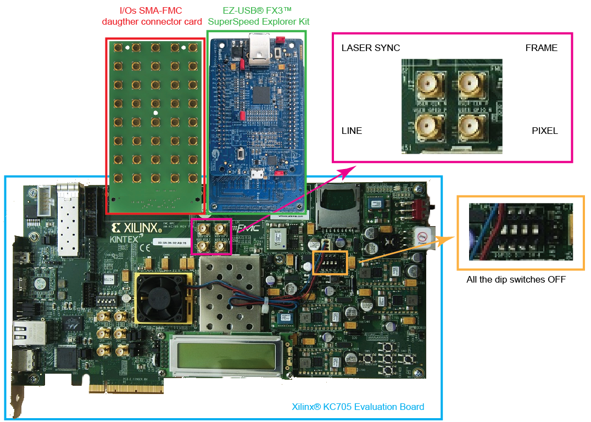

Hardware list
=============
In the table below you can find the complete list of all the needed hardware components for builing the BrightEyes-TTM.

.. toctree::
   FPGABoard
   USB3
   FMCAdapter
   IOConnectorBoard

Optional hardware parts
^^^^^^^^^^^^^^^^^^^^^^^

.. toctree::
   NIM2TTL
   DigiBuffer

PC requirements
^^^^^^^^^^^^^^^

.. list-table::
   :header-rows: 1

   * - 
     - 
   * - PC interface
     - USB 3.0 SuperSpeed
   * - PC requirements
     - min. 1.5 GHz CPU clock, min. 16 GB RAM memory, SSD hard disk
   * - Operating system
     - Linux (native) / Windows (ported)
